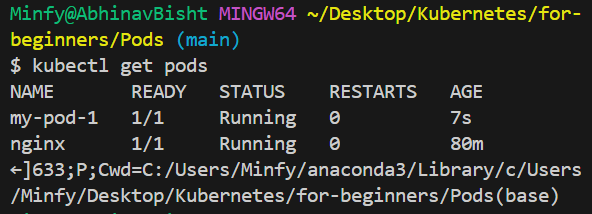
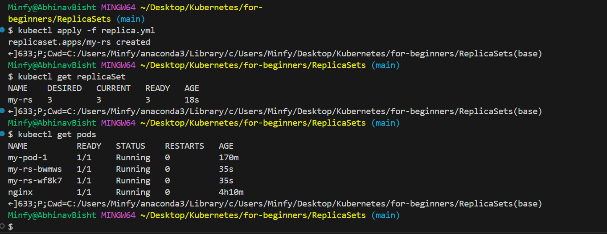

# containers

isolated env, sharing same OS kernels, type: LXC, LXD, LXCFS, docker historically used LXC now containered+runc. docker provides a high level tool to use them.

OS => kernel(interact with HW)+software(what diffs generally)

docker can run any os as long as its based on same kernel. When you run a linux container on windows, its actuall running on a linux vm. 

Thus over VM, containers are lightweight, faster to boot, but lack proper isolation
generally used together => container on VM host

We can store the images(package templates, runs same on any host) on a container registery which can be used to retrive them and then spin up the containers(running instances of images).

solve: compatibility issue + environment set up time

container orcehstrators are responsible for managing the number of and connetivity between containers. Eg docker swamp, K8s etc.

# Architecture / baisc concepts

- nodes: machine physical or virtual, with K8s installed and where containers(pods) would be launched.

- cluster: group of nodes to share load, managed by master-node(responsible for orchestration)

master-> api server(to communicate), controllers, etcd(stores info eg health),  scheduler

worker(minion)-> kubelet(agent-manages pods)(to talk), container runtime(docker, crio, rkt), kube-proxy

- kubectl: tool to manage k8s cluster

# Container runtimes

"CRI"(container runtime interface) allows any vendor to be a container runtime for K8 but docker doesn't support it and so runs without it(due to popularity implemented seperately as dockershim). Now no longer supported. Though containerd(the demon)(now as a part seperate from docker) seperately is supported. ctr is used to debug containerd. For running commands similar to docker we use "nerdctl".

"crictl" provides command line functioanlity for cri supported runtimes generally for debugging and inspecting.

# Setup

k8s service available as: loacal(minikube - preconfigured single node k8s cluster, kind), cloud managed(EKS, AKS), playground(KodeKloud).

# Pods

containers not deployed directly, are encapsulated into a k8s object called pod they are the single instance of an application.

generally 1 container of a type per pod the other containers are helpers(if scale use multiple pods)(on a pod get created and die together)(share same network ie can communicate + share same storage space)

kubectl run nginx(pod name) --image=nginx

kubectl describe pod nginx(pod name), to get info about it

# YAML

for configuration data,

key-value pair-> 

fruit: apple
liquid: water

arrays/lists-> ordered

fruits:
-   orange
-   apple
-   banana

dictionary/maps-> unordered, the nesting is managed by spaces

banana:
  calorie: 105
  fat: 0.4
grapes:
  calorie: 62
  fat: 0.3

complex example, list of dicts:

fruits:
-   banana:
      calorie: 105
      fat: 0.4
-   grapes:
      calorie: 62
      fat: 0.3    

# YAML in kubernetes

Pods:

(root level properties/required fields)

apiVersion: (pods=v1, service=v1, replicaset=apps/v1, deployment=apps/v1)
kind: (type of obj)
metadata: (name(string), labels(dict(app, type etc))(siblings) etc)(in matadata only what k8s considers metadata, but labels => your wish)

spec: (object info)(containers(list->container per element) containing dict(name, image) as elements)

kubectl create/apply -f pod-defination.yml

# replication controller 
helps run multiple instances of a single pod (or get one up if current pod goes down) providing high avability, load-balancing and scaling. Now this has been replaced by "replicaSet"

->all nest defination files

- replication controller:
apiVersion: v1
kind: ReplicationController
metadata: (name(string), labels(dict(app, type etc))(siblings) etc)(in matadata only what k8s considers metadata, but labels => your wish)

spec: (object info)(template: (pod template ie the content of pod.yml exept apiVersion and kind))(replicas: number required)

ps: selector is also present here but by default takes the value of labels provided in the pod defination files.

- replicaSet:
apiVersion: apps/v1
kind: ReplicaSet
metadata: (name(string), labels(dict(app, type etc))(siblings) etc)(in matadata only what k8s considers metadata, but labels => your wish)

spec: (object info)(template: (pod template ie the content of pod.yml exept apiVersion and kind))(replicas: number required)(selector: helps replica set identify what pods fall under it, as can manage pods existing before the replica set creation (matchLabels: key-pair to match with the metadata of the pods))

they provide a way to monitor the pods and know which pods to minitor using labels.

for replica-set even if the req no of pods exist and the template is currently not needed, we still need to provide it as we need to spin up new containers if one of the pre exiusting goes down

to increase(scale) the nuber of pods:
- modify the yml file
- kubectl scale --replicas=6 -f replicaset-definition.yml(wont affect the number in the file)
- kubectl edit replicaset myapp(set name), opens the running config of the set, applied as soon as saved
- also can be increased based on load(would be discussed later)

if you delete a pod new one is spun up, if more than required are created(manually) the extras are terminated

# Deployments